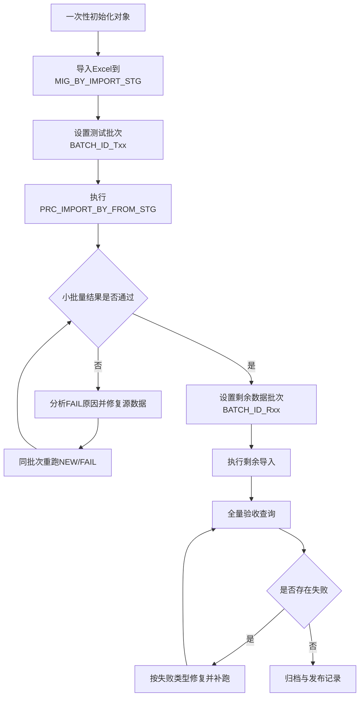
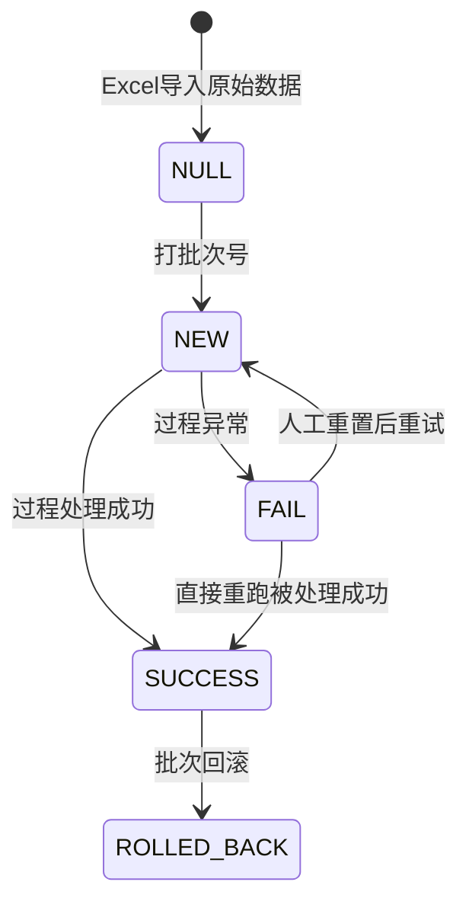

# 批量保养单数据库导入方式（优化版）

> 文档版本：v2026.04.01  
> 适用环境：Oracle 12c（CCGL/CCGLPDB）  
> 适用对象：开发、实施、运维、业务验收  
> 维护原则：先小批量验证，再全量导入；全流程按批次号隔离。

---

## 1. 文档目标与范围

本文档用于统一“巡访计划 Excel → Oracle 保养单业务表”的批量导入全流程规范，覆盖：

- 一次性初始化（建表、序列、触发器、控制表、存储过程）
- 日常导入（小批量验证、剩余全量导入）
- 异常处理（`FAIL` 场景、数据修复后补跑）
- 查询验收（状态、时间链、间隔规则、失败根因）
- 运维治理（回滚、复跑、发布前检查、风险控制）

---

## 2. 业务流程总览

### 2.1 总体流程（开发→使用→运维）



### 2.2 状态机说明（`MIG_BY_IMPORT_STG.STATUS`）



---

## 3. 核心对象与职责

## 3.1 对象清单

| 对象 | 类型 | 职责 |
| --- | --- | --- |
| `MIG_BY_IMPORT_STG` | 暂存表 | 承接 Excel 数据、记录批次状态与生成结果 |
| `SEQ_MIG_BY_IMPORT_STG` | 序列 | 生成 `STG_ID` |
| `TRG_MIG_BY_IMPORT_STG_BI` | 触发器 | 插入时补全 `STG_ID/CREATE_TIME` |
| `MIG_BY_NO_CTRL` | 控制表 | 管理 `BY` 业务单号下一个可用编号 |
| `PRC_IMPORT_BY_FROM_STG` | 过程 | 执行校验、生成时间链、写入五张业务表、回写状态 |

## 3.2 `MIG_BY_NO_CTRL` 的关键作用

- 管理保养单号（`BYxxxxxx`）发号，不参与 Excel 字段映射。
- 导入前与主表最大 `BY` 号自动对齐，防止与前台开单冲突。
- 逐条成功后递增，保证单号连续与幂等重试可控。
- `FOR UPDATE` 保证并发下不重复取号。

---

## 4. 一次性初始化（先执行一次）

> 正式库首跑前执行；已存在对象时按“增量修复”处理。

### 4.1 初始化前检查

```sql
SELECT TABLE_NAME
  FROM USER_TABLES
 WHERE TABLE_NAME IN ('MIG_BY_IMPORT_STG','MIG_BY_NO_CTRL');

SELECT OBJECT_NAME, STATUS
  FROM USER_OBJECTS
 WHERE OBJECT_NAME = 'PRC_IMPORT_BY_FROM_STG';
```

### 4.2 初始化执行内容

执行基础文档中的整段 SQL（建表、序列、触发器、控制表、过程）。

```sql
/* =========================================
   A. 暂存表（Excel导入中间表）
   参考列：磁卡号,custcd,区域,巡访员,机型,上门工程师,日期
   ========================================= */
CREATE TABLE MIG_BY_IMPORT_STG (
    STG_ID                NUMBER(18) PRIMARY KEY,
    BATCH_ID              VARCHAR2(40),
    CUSTCARD              VARCHAR2(50) NOT NULL,   -- 磁卡号
    CUSTCD_INPUT          VARCHAR2(20),            -- Excel里的custcd(用于校验)
    AREA_NAME             VARCHAR2(100),           -- 区域
    PATROLLER             VARCHAR2(50),            -- 巡访员
    MACHINE_TYPE          VARCHAR2(100),           -- 机型
    ENGINEER_ID           VARCHAR2(20) NOT NULL,   -- 上门工程师
    PLAN_DATE             DATE NOT NULL,           -- 日期(只到日)
    STATUS                VARCHAR2(20) DEFAULT 'NEW', -- NEW/SUCCESS/FAIL/ROLLED_BACK
    ERR_MSG               VARCHAR2(1000),

    GEN_DAILY_ID          VARCHAR2(20),
    GEN_STORE_ID          VARCHAR2(20),
    GEN_REQUEST_TIME      DATE,
    GEN_ARRIVE_TIME       DATE,
    GEN_LEAVE_TIME        DATE,
    GEN_CLOSE_TIME        DATE,
    GEN_RV_TIME           DATE,

    CREATE_TIME           DATE DEFAULT SYSDATE,
    UPDATE_TIME           DATE
);

CREATE SEQUENCE SEQ_MIG_BY_IMPORT_STG START WITH 1 INCREMENT BY 1 NOCACHE;

CREATE OR REPLACE TRIGGER TRG_MIG_BY_IMPORT_STG_BI
BEFORE INSERT ON MIG_BY_IMPORT_STG
FOR EACH ROW
BEGIN
    IF :NEW.STG_ID IS NULL THEN
        SELECT SEQ_MIG_BY_IMPORT_STG.NEXTVAL INTO :NEW.STG_ID FROM DUAL;
    END IF;
    IF :NEW.CREATE_TIME IS NULL THEN
        :NEW.CREATE_TIME := SYSDATE;
    END IF;
END;
/

/* =========================================
   B. BY单号控制表（从BY021601开始）
   ========================================= */
CREATE TABLE MIG_BY_NO_CTRL (
    BILL_TYPE   VARCHAR2(2) PRIMARY KEY,
    NEXT_NO     NUMBER(10) NOT NULL,
    UPDATE_TIME DATE
);

MERGE INTO MIG_BY_NO_CTRL T
USING (SELECT 'BY' AS BILL_TYPE FROM DUAL) S
ON (T.BILL_TYPE = S.BILL_TYPE)
WHEN NOT MATCHED THEN
  INSERT (BILL_TYPE, NEXT_NO, UPDATE_TIME)
  VALUES ('BY', 21601, SYSDATE);

/* =========================================
   C. 导入主过程
   ========================================= */
CREATE OR REPLACE PROCEDURE PRC_IMPORT_BY_FROM_STG (
    P_BATCH_ID        IN VARCHAR2,
    P_CREATOR         IN VARCHAR2 DEFAULT '2393',
    P_FORCE_START_NO  IN NUMBER   DEFAULT NULL  -- 传21601可强制从BY021601起
) AS
    TYPE T_REQ_TIME_MAP IS TABLE OF DATE INDEX BY VARCHAR2(64);

    L_CUSTCD         VARCHAR2(20);
    L_CUST_CNT       NUMBER;
    L_NEXT_NO        NUMBER;
    L_DAILY_ID       VARCHAR2(20);

    L_REQUEST_TIME   DATE;
    L_LAST_REQUEST_TIME DATE;
    L_FIRST_TIME     DATE;
    L_ARRIVE_TIME    DATE;
    L_LEAVE_TIME     DATE;
    L_CLOSE_TIME     DATE;
    L_RV_TIME        DATE;
    L_REQ_KEY        VARCHAR2(64);
    L_D2D_LEAVE_DESC VARCHAR2(200);
    L_REQ_TIME_MAP   T_REQ_TIME_MAP;

    L_ERR            VARCHAR2(1000);
BEGIN
    IF P_BATCH_ID IS NULL THEN
        RAISE_APPLICATION_ERROR(-20001, 'P_BATCH_ID不能为空');
    END IF;

    /* 导入前：单号对齐（防止与前台开单冲突）
       规则：
       1) 若传了 P_FORCE_START_NO，则按强制值重置（仅初始化/特殊场景）
       2) 否则自动与 TIT17_MAINTENANCE 当前最大 BY 号对齐，取更大值
    */
    DECLARE
        L_DB_MAX_NO   NUMBER;
        L_CTRL_NO     NUMBER;
        L_FINAL_NEXT  NUMBER;
    BEGIN
        SELECT NVL(MAX(TO_NUMBER(SUBSTR(DAILY_MAINTENANCE_ID, 3))), 21600)
          INTO L_DB_MAX_NO
          FROM TIT17_MAINTENANCE
         WHERE DAILY_MAINTENANCE_ID LIKE 'BY______'
           AND REGEXP_LIKE(SUBSTR(DAILY_MAINTENANCE_ID, 3), '^[0-9]{6}$');

        SELECT NEXT_NO
          INTO L_CTRL_NO
          FROM MIG_BY_NO_CTRL
         WHERE BILL_TYPE = 'BY'
         FOR UPDATE;

        IF P_FORCE_START_NO IS NOT NULL THEN
            L_FINAL_NEXT := P_FORCE_START_NO;
        ELSE
            L_FINAL_NEXT := GREATEST(L_CTRL_NO, L_DB_MAX_NO + 1);
        END IF;

        UPDATE MIG_BY_NO_CTRL
           SET NEXT_NO = L_FINAL_NEXT,
               UPDATE_TIME = SYSDATE
         WHERE BILL_TYPE = 'BY';

        COMMIT;
    END;

    /* 把本批次空状态行补成NEW */
    UPDATE MIG_BY_IMPORT_STG
       SET STATUS = 'NEW',
           BATCH_ID = P_BATCH_ID,
           UPDATE_TIME = SYSDATE
     WHERE BATCH_ID = P_BATCH_ID
       AND STATUS IS NULL;

    COMMIT;

    FOR R IN (
        SELECT *
          FROM MIG_BY_IMPORT_STG
         WHERE BATCH_ID = P_BATCH_ID
           AND STATUS IN ('NEW','FAIL')
         ORDER BY STG_ID
    ) LOOP
        SAVEPOINT SP_ONE_ROW;
        BEGIN
            /* 1) 基础校验 */
            IF R.CUSTCARD IS NULL THEN
                RAISE_APPLICATION_ERROR(-20011, '磁卡号为空');
            END IF;

            IF R.ENGINEER_ID IS NULL THEN
                RAISE_APPLICATION_ERROR(-20012, '上门工程师为空');
            END IF;

            IF R.PLAN_DATE IS NULL THEN
                RAISE_APPLICATION_ERROR(-20013, '日期为空');
            END IF;

            /* 2) 磁卡号 -> custcd 映射（唯一） */
            SELECT COUNT(*), MAX(CUSTCD)
              INTO L_CUST_CNT, L_CUSTCD
              FROM TMM22_CUSTOMERS
             WHERE CUSTCARD = R.CUSTCARD
               AND USEFLG = '1';

            IF L_CUST_CNT <> 1 THEN
                RAISE_APPLICATION_ERROR(-20014, '磁卡号未唯一匹配custcd，磁卡号=' || R.CUSTCARD);
            END IF;

            IF R.CUSTCD_INPUT IS NOT NULL AND TRIM(R.CUSTCD_INPUT) <> TRIM(L_CUSTCD) THEN
                RAISE_APPLICATION_ERROR(-20015, 'Excel custcd与系统映射不一致，磁卡号=' || R.CUSTCARD);
            END IF;

            /* 3) 生成单号 BYxxxxxx */
            SELECT NEXT_NO
              INTO L_NEXT_NO
              FROM MIG_BY_NO_CTRL
             WHERE BILL_TYPE = 'BY'
             FOR UPDATE;

            L_DAILY_ID := 'BY' || LPAD(L_NEXT_NO, 6, '0');

            UPDATE MIG_BY_NO_CTRL
               SET NEXT_NO = L_NEXT_NO + 1,
                   UPDATE_TIME = SYSDATE
             WHERE BILL_TYPE = 'BY';

            /* 4) 生成时间链
                  同一天同工程师：后续单据在上一单request_time基础上约+1小时（55~65分钟）
                  首单request_time：08:30~10:00随机
                  first_time   = request_time后1~5分钟
                  arrive_time  = first_time
                  leave_time   = first_time后25~35分钟
                  rv_time      = leave后+3~8分钟
                  close_time   = rv后+10~50秒（约1分钟内，且保证rv_time < close_time）
            */
            L_REQ_KEY := TRIM(R.ENGINEER_ID) || '|' || TO_CHAR(TRUNC(R.PLAN_DATE), 'YYYYMMDD');

            IF L_REQ_TIME_MAP.EXISTS(L_REQ_KEY) THEN
                L_LAST_REQUEST_TIME := L_REQ_TIME_MAP(L_REQ_KEY);
            ELSE
                SELECT MAX(REQUEST_TIME)
                  INTO L_LAST_REQUEST_TIME
                  FROM TIT17_MAINTENANCE
                 WHERE REQUEST_ENGINNER_ID = R.ENGINEER_ID
                   AND TRUNC(REQUEST_TIME) = TRUNC(R.PLAN_DATE);
            END IF;

            IF L_LAST_REQUEST_TIME IS NULL THEN
                L_REQUEST_TIME := TRUNC(R.PLAN_DATE) + (510 + TRUNC(DBMS_RANDOM.VALUE(0, 91))) / 1440;
            ELSE
                L_REQUEST_TIME := L_LAST_REQUEST_TIME + (55 + TRUNC(DBMS_RANDOM.VALUE(0, 11))) / 1440;
            END IF;

            L_REQUEST_TIME := L_REQUEST_TIME + (1 + TRUNC(DBMS_RANDOM.VALUE(0, 59))) / 86400;
            L_REQ_TIME_MAP(L_REQ_KEY) := L_REQUEST_TIME;

            L_FIRST_TIME   := L_REQUEST_TIME + (1 + TRUNC(DBMS_RANDOM.VALUE(0, 5))) / 1440;
            L_ARRIVE_TIME  := L_FIRST_TIME;
            L_LEAVE_TIME   := L_FIRST_TIME + (25 + TRUNC(DBMS_RANDOM.VALUE(0, 11))) / 1440;
            L_RV_TIME      := L_LEAVE_TIME + (3 + TRUNC(DBMS_RANDOM.VALUE(0, 6))) / 1440;
            L_CLOSE_TIME   := L_RV_TIME + (10 + TRUNC(DBMS_RANDOM.VALUE(0, 41))) / 86400;
            L_D2D_LEAVE_DESC := CASE
                                   WHEN TRIM(R.MACHINE_TYPE) IS NULL THEN '关门'
                                   ELSE TRIM(R.MACHINE_TYPE) || '机器'
                                END;

            /* 5) TIT17_MAINTENANCE */
            INSERT INTO TIT17_MAINTENANCE (
                DAILY_MAINTENANCE_ID, STORE_ID, HAS_VIDEO_DEVICE, VIDEO_DEVICE_STATUS, VIDEO_DEVICE_ERROR_DES,
                REQUEST_ENGINNER_ID, REQUEST_TIME, SHORT_DESCRIPTION, DETAIL_DESCRIPTION,
                CURRENT_STATUS, IS_OLD, IS_SUCCESS,
                CREATE_TIME, CREATOR, UPDATE_TIME, UPDATOR,
                FIRSTOR, FIRST_TIME, LEAVE_TIME, CLOSE_TIME, REVISIT_TIME
            ) VALUES (
                L_DAILY_ID, L_CUSTCD, 'N', NULL, NULL,
                R.ENGINEER_ID, L_REQUEST_TIME, '日常保养', NULL,
                '3', 'N', '1',
                L_REQUEST_TIME, P_CREATOR, NULL, NULL,
                R.ENGINEER_ID, L_FIRST_TIME, L_LEAVE_TIME, L_CLOSE_TIME, L_RV_TIME
            );

            /* 6) TIT17_CUST_POS_DAILY - POS(typflg=1) */
            INSERT INTO TIT17_CUST_POS_DAILY (
                DAILY_MAINTENANCE_ID, BUSINESS_OPERATION_ID, CUSTCD, EID, ITEMCD,
                STARTDATE, SYSINFO, SOFTINFO, POSUPDDATE, POSINFO, AREA,
                STATUS, TYPFLG, MAINTENANCEDATE, MAINTENANCETYP,
                REQUEST_ENGINNER_ID, REQUEST_TIME, SHORT_DESCRIPTION, DETAIL_DESCRIPTION,
                CREATE_TIME, CREATOR, UPDATE_TIME, UPDATOR, USEFLG
            )
            SELECT
                L_DAILY_ID,
                ROW_NUMBER() OVER (ORDER BY T.EID, T.ITEMCD),
                T.CUSTCD, T.EID, T.ITEMCD,
                T.STARTDATE, T.SYSINFO, T.SOFTINFO, T.POSUPDDATE, T.POSINFO, T.AREA,
                '1', '1', T.MAINTENANCEDATE, T.MAINTENANCETYP,
                R.ENGINEER_ID, L_REQUEST_TIME, '日常保养', NULL,
                L_REQUEST_TIME, P_CREATOR, NULL, NULL, '1'
            FROM TMM35_CUST_POS_RL T
            WHERE T.CUSTCD = L_CUSTCD
              AND T.USEFLG = '1';

            /* 7) TIT23_MAINTENANCE_D2D 两条：到店(1)、离店(2) */
            INSERT INTO TIT23_MAINTENANCE_D2D (
                MAINTENANCE_ID, BUSINESS_OPERATION_ID, D2D_ENGINEER,
                ARRIVE_TIME, LEAVE_TIME, D2D_DESCRIPITON, D2D_PHONE,
                OLD_BUSINESS_ID, D2D_GROUP, D2D_TYPE,
                CREATE_TIME, CREATOR, UPDATE_TIME, UPDATOR, USEFLG
            ) VALUES (
                L_DAILY_ID, 1, R.ENGINEER_ID,
                L_ARRIVE_TIME, NULL, NULL, NULL,
                0, 1, '1',
                L_ARRIVE_TIME, P_CREATOR, SYSDATE, P_CREATOR, '1'
            );

            INSERT INTO TIT23_MAINTENANCE_D2D (
                MAINTENANCE_ID, BUSINESS_OPERATION_ID, D2D_ENGINEER,
                ARRIVE_TIME, LEAVE_TIME, D2D_DESCRIPITON, D2D_PHONE,
                OLD_BUSINESS_ID, D2D_GROUP, D2D_TYPE,
                CREATE_TIME, CREATOR, UPDATE_TIME, UPDATOR, USEFLG
            ) VALUES (
                L_DAILY_ID, 2, R.ENGINEER_ID,
                L_ARRIVE_TIME, L_LEAVE_TIME, L_D2D_LEAVE_DESC, NULL,
                0, 1, '2',
                L_ARRIVE_TIME, P_CREATOR, SYSDATE, P_CREATOR, '1'
            );

            /* 8) TIT24_MAINTENANCE_RV */
            INSERT INTO TIT24_MAINTENANCE_RV (
                MAINTENANCE_ID, BUSINESS_OPERATION_ID, RV_TIME, RV_OPERATOR,
                FEEDBACK, SATISFACTION, CREATE_TIME, CREATOR, UPDATE_TIME, UPDATOR
            ) VALUES (
                L_DAILY_ID, 1, L_RV_TIME, R.ENGINEER_ID,
                '满意', '1', L_RV_TIME, P_CREATOR, NULL, NULL
            );

            /* 9) TIT27_CLOSE_BILLS */
            INSERT INTO TIT27_CLOSE_BILLS (
                MAINTENANCE_ID, BUSINESS_OPERATION_ID, CLOSE_TIME, CLOSE_TYPE,
                IS_OLD, CREATE_TIME, CREATOR
            ) VALUES (
                L_DAILY_ID, 1, L_CLOSE_TIME, 'BY',
                'N', L_CLOSE_TIME, P_CREATOR
            );

            /* 10) 标记成功 */
            UPDATE MIG_BY_IMPORT_STG
               SET STATUS = 'SUCCESS',
                   ERR_MSG = NULL,

                   GEN_DAILY_ID = L_DAILY_ID,
                   GEN_STORE_ID = L_CUSTCD,
                   GEN_REQUEST_TIME = L_REQUEST_TIME,
                   GEN_ARRIVE_TIME = L_ARRIVE_TIME,
                   GEN_LEAVE_TIME = L_LEAVE_TIME,
                   GEN_CLOSE_TIME = L_CLOSE_TIME,
                   GEN_RV_TIME = L_RV_TIME,
                   UPDATE_TIME = SYSDATE
             WHERE STG_ID = R.STG_ID;

            COMMIT;

        EXCEPTION
            WHEN OTHERS THEN
                ROLLBACK TO SP_ONE_ROW;
                L_ERR := SUBSTR(SQLERRM, 1, 900);

                UPDATE MIG_BY_IMPORT_STG
                   SET STATUS = 'FAIL',
                       ERR_MSG = L_ERR,
                       UPDATE_TIME = SYSDATE
                 WHERE STG_ID = R.STG_ID;

                COMMIT;
        END;
    END LOOP;
END;
/
```

### 4.3 初始化后验收

```sql
SELECT OBJECT_NAME, STATUS
  FROM USER_OBJECTS
 WHERE OBJECT_NAME = 'PRC_IMPORT_BY_FROM_STG';

SELECT * FROM MIG_BY_NO_CTRL WHERE BILL_TYPE = 'BY';
```

---

## 5. 日常导入标准作业（SOP）

## 5.1 Excel 导入口径

字段映射：

- `磁卡号` -> `CUSTCARD`
- `custcd` -> `CUSTCD_INPUT`
- `机型` -> `MACHINE_TYPE`
- `区域` -> `AREA_NAME`
- `巡访员` -> `PATROLLER`
- `上门工程师` -> `ENGINEER_ID`
- `日期` -> `PLAN_DATE`（按 `DATE` 导入）

约束说明：

- 日期必须按日期类型导入，禁止字符串化。目前使用的 (MM/DD/YYYY)，具体根据导入数据过程中看数据显示格式
- 需避免全角空格/不可见字符污染磁卡号。
- `BATCH_ID` 建议由 SQL 统一打标，不在 Excel 中维护。

## 5.2 场景A：小批量导入（先 10 条）

示例批次：`BY20260401_P_T01`

```sql
/* 0) 清理历史测试批次（可选） */
DELETE FROM MIG_BY_IMPORT_STG
 WHERE BATCH_ID IN ('BY20260401_P_T00');
COMMIT;

/* 1) 选10条未分批数据 */
UPDATE MIG_BY_IMPORT_STG T
   SET T.BATCH_ID = 'BY20260401_P_T01',
       T.STATUS = 'NEW',
       T.ERR_MSG = NULL,
       T.UPDATE_TIME = SYSDATE
 WHERE T.STG_ID IN (
       SELECT STG_ID
         FROM (
               SELECT STG_ID
                 FROM MIG_BY_IMPORT_STG
                WHERE BATCH_ID IS NULL
                ORDER BY STG_ID
              ) X
        WHERE ROWNUM <= 10
 );
COMMIT;

/* 2) 执行导入 */
BEGIN
    PRC_IMPORT_BY_FROM_STG(
        P_BATCH_ID       => 'BY20260401_P_T01',
        P_CREATOR        => '2393',
        P_FORCE_START_NO => NULL
    );
END;
/

/* 3) 结果检查 */
SELECT STATUS, COUNT(*) CNT
  FROM MIG_BY_IMPORT_STG
 WHERE BATCH_ID = 'BY20260401_P_T01'
 GROUP BY STATUS;
```

## 5.3 场景B：剩余数据导入

示例批次：`BY20260401_P_R01`

```sql
UPDATE MIG_BY_IMPORT_STG
   SET BATCH_ID = 'BY20260401_P_R01',
       STATUS = 'NEW',
       ERR_MSG = NULL,
       UPDATE_TIME = SYSDATE
 WHERE BATCH_ID IS NULL;
COMMIT;

BEGIN
    PRC_IMPORT_BY_FROM_STG(
        P_BATCH_ID       => 'BY20260401_P_R01',
        P_CREATOR        => '2393',
        P_FORCE_START_NO => NULL
    );
END;
/

SELECT STATUS, COUNT(*) CNT
  FROM MIG_BY_IMPORT_STG
 WHERE BATCH_ID = 'BY20260401_P_R01'
 GROUP BY STATUS;
```

---

## 6. 异常处理与补跑场景

## 6.1 场景C：单条/少量 `FAIL`，修复后补跑同批次

适用：数据修复后不希望新开批次。

```sql
/* 把失败记录重置为NEW（可选，不改也可直接重跑） */
UPDATE MIG_BY_IMPORT_STG
   SET STATUS = 'NEW',
       ERR_MSG = NULL,
       UPDATE_TIME = SYSDATE
 WHERE BATCH_ID = 'BY20260401_P_R01'
   AND STATUS = 'FAIL';
COMMIT;

/* 重跑同批次：只处理NEW/FAIL，SUCCESS不会重复 */
BEGIN
    PRC_IMPORT_BY_FROM_STG(
        P_BATCH_ID       => 'BY20260401_P_R01',
        P_CREATOR        => '2393',
        P_FORCE_START_NO => NULL
    );
END;
/
```

## 6.2 场景D：`ORA-20014`（磁卡号未唯一匹配）排查

```sql
/* 失败明细 */
SELECT STG_ID, CUSTCARD, ENGINEER_ID, PLAN_DATE, ERR_MSG
  FROM MIG_BY_IMPORT_STG
 WHERE BATCH_ID = 'BY20260401_P_R01'
   AND STATUS = 'FAIL'
 ORDER BY STG_ID;

/* 客户表匹配情况（过程口径） */
SELECT CUSTCARD,
       COUNT(*) AS CNT_ALL,
       SUM(CASE WHEN USEFLG = '1' THEN 1 ELSE 0 END) AS CNT_USE1
  FROM TMM22_CUSTOMERS
 WHERE CUSTCARD IN (
       SELECT CUSTCARD
         FROM MIG_BY_IMPORT_STG
        WHERE BATCH_ID = 'BY20260401_P_R01'
          AND STATUS = 'FAIL'
 )
 GROUP BY CUSTCARD;
```

常见根因：

- 同一磁卡号在客户表中多条，且有效状态不唯一。
- 暂存表磁卡号存在不可见字符。
- 正式库与测试库基础数据（`TMM22_CUSTOMERS`）不一致。

## 6.3 场景E：是否取消 `USEFLG='1'` 过滤

当前过程为：

```sql
WHERE CUSTCARD = R.CUSTCARD
  AND USEFLG = '1';
```

若取消该过滤，只需改这一处为：

```sql
WHERE CUSTCARD = R.CUSTCARD;
```

风险：

- 多条匹配概率上升，`L_CUST_CNT <> 1` 仍会失败。
- 建议优先治理主数据唯一性，不建议直接放开过滤。

---

## 7. 查询与验收清单（各种场景通用）

## 7.1 批次状态总览

```sql
SELECT STATUS, COUNT(*) CNT
  FROM MIG_BY_IMPORT_STG
 WHERE BATCH_ID = :BATCH_ID
 GROUP BY STATUS;
```

## 7.2 失败明细

```sql
SELECT STG_ID, CUSTCARD, CUSTCD_INPUT, ENGINEER_ID, PLAN_DATE, ERR_MSG
  FROM MIG_BY_IMPORT_STG
 WHERE BATCH_ID = :BATCH_ID
   AND STATUS = 'FAIL'
 ORDER BY STG_ID;
```

## 7.3 生成结果核验

```sql
SELECT STG_ID, GEN_DAILY_ID, GEN_STORE_ID,
       GEN_REQUEST_TIME, GEN_RV_TIME, GEN_CLOSE_TIME
  FROM MIG_BY_IMPORT_STG
 WHERE BATCH_ID = :BATCH_ID
   AND STATUS = 'SUCCESS'
 ORDER BY STG_ID;
```

## 7.4 同工程师同日时间间隔异常（55~65 分钟）

```sql
WITH T AS (
    SELECT M.DAILY_MAINTENANCE_ID,
           M.STORE_ID,
           M.REQUEST_ENGINNER_ID,
           M.REQUEST_TIME,
           TRUNC(M.REQUEST_TIME) AS PLAN_DAY
      FROM TIT17_MAINTENANCE M
      JOIN MIG_BY_IMPORT_STG S
        ON S.GEN_DAILY_ID = M.DAILY_MAINTENANCE_ID
     WHERE S.BATCH_ID = :BATCH_ID
       AND S.STATUS = 'SUCCESS'
),
X AS (
    SELECT T.*,
           ROUND(
             (REQUEST_TIME - LAG(REQUEST_TIME) OVER (
                PARTITION BY REQUEST_ENGINNER_ID, PLAN_DAY
                ORDER BY REQUEST_TIME
             )) * 24 * 60,
             2
           ) AS DIFF_MIN
      FROM T
)
SELECT *
  FROM X
 WHERE DIFF_MIN IS NOT NULL
   AND (DIFF_MIN < 55 OR DIFF_MIN > 65)
 ORDER BY REQUEST_ENGINNER_ID, PLAN_DAY, REQUEST_TIME;
```

## 7.5 回访与关单先后关系（`RV_TIME < CLOSE_TIME`）

```sql
SELECT STG_ID, GEN_DAILY_ID, GEN_RV_TIME, GEN_CLOSE_TIME
  FROM MIG_BY_IMPORT_STG
 WHERE BATCH_ID = :BATCH_ID
   AND STATUS = 'SUCCESS'
   AND GEN_RV_TIME >= GEN_CLOSE_TIME;
```

---

## 8. 运维与回滚

## 8.1 批次回滚（仅回滚本批成功数据）

> 顺序必须：子表 → 主表 → 暂存状态回写。

```sql
DELETE FROM TIT27_CLOSE_BILLS
 WHERE MAINTENANCE_ID IN (
   SELECT GEN_DAILY_ID
     FROM MIG_BY_IMPORT_STG
    WHERE BATCH_ID = :BATCH_ID
      AND STATUS = 'SUCCESS'
 );

DELETE FROM TIT24_MAINTENANCE_RV
 WHERE MAINTENANCE_ID IN (
   SELECT GEN_DAILY_ID
     FROM MIG_BY_IMPORT_STG
    WHERE BATCH_ID = :BATCH_ID
      AND STATUS = 'SUCCESS'
 );

DELETE FROM TIT23_MAINTENANCE_D2D
 WHERE MAINTENANCE_ID IN (
   SELECT GEN_DAILY_ID
     FROM MIG_BY_IMPORT_STG
    WHERE BATCH_ID = :BATCH_ID
      AND STATUS = 'SUCCESS'
 );

DELETE FROM TIT17_CUST_POS_DAILY
 WHERE DAILY_MAINTENANCE_ID IN (
   SELECT GEN_DAILY_ID
     FROM MIG_BY_IMPORT_STG
    WHERE BATCH_ID = :BATCH_ID
      AND STATUS = 'SUCCESS'
 );

DELETE FROM TIT17_MAINTENANCE
 WHERE DAILY_MAINTENANCE_ID IN (
   SELECT GEN_DAILY_ID
     FROM MIG_BY_IMPORT_STG
    WHERE BATCH_ID = :BATCH_ID
      AND STATUS = 'SUCCESS'
 );

UPDATE MIG_BY_IMPORT_STG
   SET STATUS = 'ROLLED_BACK',
       UPDATE_TIME = SYSDATE
 WHERE BATCH_ID = :BATCH_ID
   AND STATUS = 'SUCCESS';

COMMIT;
```

## 8.2 发布前检查（正式库）

- 确认连接串与库实例正确（`CCGLPDB`）。
- 确认过程 `VALID`。
- 确认 `MIG_BY_NO_CTRL` 当前号段。
- 先执行小批量，验收通过后再导剩余。
- 对失败数据先修复主数据，再同批次补跑。

---

## 9. 常见误区与纠偏

- 误区：复用旧 `BATCH_ID`。  
  纠偏：每轮新批次号，避免混批。

- 误区：在 `SQL>` 提示符下输入 `sqlplus ...`。  
  纠偏：`sqlplus` 命令只能在操作系统命令行执行。

- 误区：SQL 使用中文标点（`，`、`；`）。  
  纠偏：统一英文符号，防止语句未执行。

- 误区：认为 `SUCCESS` 会被重复处理。  
  纠偏：过程只处理 `STATUS IN ('NEW','FAIL')`。

---

## 10. 维护建议

- 本文档为主操作手册，历史试验过程建议迁移到“附录/变更记录”。
- 测试库与正式库主数据（尤其 `TMM22_CUSTOMERS`）应定期做差异比对。
- 后续如调整业务规则（如是否保留 `USEFLG='1'`），应同步更新：
  - 存储过程 SQL
  - 验收口径 SQL
  - 回归测试记录

---

## 11. 变更记录

- `2026-04-01`：首版优化，完成开发-使用-运维全流程重构，增加流程图、场景化 SQL、排障与运维清单。
