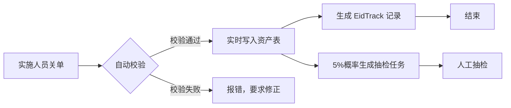

# 实施单资产同步开发规范

> **适用范围**: 日常维护单（TIT10_MAINTENANCEDAY）关单时的资产同步流程  
> **创建时间**: 2026-05-12  
> **关联文档**: [设备安装日期初始化与追踪 Spec](docs/superpowers/specs/2026-05-12-device-install-date-tracking.md)

---

## 1. 背景与问题

### 1.1 历史问题

当前 PB 老系统存在以下问题：
- **时间不一致**: 预计划实施关单时间（2023-03-30）与实际资产入库时间（2023-03-31）相差一天
- **双重人工**: 实施关单后还需要配置管理人工审核才能写入资产表
- **体外循环**: 部分设备（如烟草直营店）不走标准预计划流程，导致时间记录缺失

### 1.2 根本原因

```
旧流程: 实施关单 → 夜间批处理/人工审核 → 写入资产表 (T+1)
           ↑                                    ↓
    plan_cust.imple_date=2023-03-30      tmm43_eid.install_date=2023-03-31
```

---

## 2. 主流 ITSM 最佳实践

### 2.1 行业做法（ITIL 4 / SaaS ITSM）

| 环节 | 主流做法 | 关键特征 |
|------|---------|---------|
| 服务请求关单 | 现场完成即生效 | 数字化实时同步，无隔夜延迟 |
| 资产同步 | API 实时写入 | 关单 → Webhook → 资产系统 |
| 复核机制 | 前置到关单前或抽检 | 不是100%人工复核，是异常抽检 |
| 时间记录 | 单一时间戳（实际完成时间） | 关单时间 = 资产生效时间 |

### 2.2 对比分析

| 维度 | 主流做法 | 老系统 | 改造方向 |
|------|---------|--------|---------|
| 时效性 | 实时 | T+1（隔日） | ❌ 需优化 |
| 人工介入 | 自动化为主 | 必须人工审核 | ⚠️ 需简化 |
| 时间口径 | 关单时间 = 生效时间 | 关单 ≠ 生效，差1天 | ❌ 需统一 |

---

## 3. 新系统开发要求

### 3.1 核心原则

```
关单即生效：实施单关单时，资产数据实时写入客户资产表
时间一致性：install_date = 关单时间（close_time）
校验前置化：关单前自动完成数据校验，替代事后人工审核
```

### 3.2 业务流程



### 3.3 接口规范

#### 3.3.1 关单校验规则

```python
# 关单前必须校验的字段
def validate_before_close(maintenance_data):
    required_fields = {
        'device_eid': '设备序列号必须存在且格式正确',
        'store_id': '门店编码必须存在',
        'asset_type': '资产类型必须选择（AT码表）',
        'item_cd': '物料编码必须匹配 Eid 表记录'
    }
    
    # 校验1: 设备序列号存在性
    if not Eid.query.filter_by(eid=device_eid).first():
        raise ValidationError(f"设备 {device_eid} 不存在")
    
    # 校验2: 物料编码一致性
    eid_record = Eid.query.filter_by(eid=device_eid).first()
    if eid_record.itemcd != item_cd:
        raise ValidationError(f"物料编码不一致: Eid表={eid_record.itemcd}, 单据={item_cd}")
    
    # 校验3: 门店存在性
    if not Customer.query.filter_by(cust_cd=store_id).first():
        raise ValidationError(f"门店 {store_id} 不存在")
    
    return True
```

#### 3.3.2 资产写入接口

```python
# 实施单关单时调用
@transactional
def sync_asset_on_close(maintenance_id: str):
    """
    实施单关单时同步资产数据
    
    Args:
        maintenance_id: 维护单号
    """
    # 1. 获取维护单数据
    task = MaintenanceDay.query.get(maintenance_id)
    
    # 2. 写入/更新 tmm43_eid
    eid_record = Eid.query.filter_by(eid=task.device_eid).first()
    eid_record.install_date = task.close_time  # 关单时间
    eid_record.asset_type = task.asset_type
    eid_record.asset_owner = 'CUSTOMER'  # 分配给客户
    # ... 其他字段
    
    # 3. 写入/更新 tmm35_cust_pos_rl
    cust_pos = CustPosRl.query.filter_by(
        eid=task.device_eid, 
        useflg='1'
    ).first()
    
    if not cust_pos:
        cust_pos = CustPosRl(
            cust_cd=task.store_id,
            eid=task.device_eid,
            item_cd=task.item_cd,
            useflg='1'
        )
        db.session.add(cust_pos)
    
    # 4. 生成 EidTrack 记录（设备流转历史）
    track = EidTrack(
        type='C',  # C=客户分配
        eid=task.device_eid,
        change_date=task.close_time,
        cust_cd=None,  # 变更前（仓库）
        n_cust_cd=task.store_id,  # 变更后（客户）
        install_date=None,  # 变更前
        n_install_date=task.close_time,  # 变更后
        refid=maintenance_id  # 关联维护单
    )
    db.session.add(track)
    
    db.session.commit()
```

#### 3.3.3 抽检机制（可选）

```python
import random

def create_audit_task(maintenance_id: str):
    """
    5%概率生成抽检任务
    """
    if random.random() < 0.05:
        audit_task = AuditTask(
            source_type='MAINTENANCE',
            source_id=maintenance_id,
            audit_type='SPOT_CHECK',
            status='PENDING'
        )
        db.session.add(audit_task)
        db.session.commit()
        
        # 发送待办通知给配置管理员
        send_notification(
            role='CONFIG_MANAGER',
            message=f"维护单 {maintenance_id} 需要抽检复核"
        )
```

### 3.4 数据库变更

#### 3.4.1 EidTrack 新增字段（已完成）

```sql
-- 已实施的字段扩展
ALTER TABLE tmm43_eid_track ADD COLUMN install_date TIMESTAMP;
ALTER TABLE tmm43_eid_track ADD COLUMN n_install_date TIMESTAMP;
ALTER TABLE tmm43_eid_track ADD COLUMN cust_cd VARCHAR(20);
ALTER TABLE tmm43_eid_track ADD COLUMN n_cust_cd VARCHAR(20);
-- ... 共12个字段
```

#### 3.4.2 码表数据（已完成）

```sql
-- ETK = Eid Track Type
INSERT INTO tmm31_syscodes (code_typ, code_cd, code_nm, useflg, sort_no) VALUES
('ETK', 'C', '客户分配', '1', 1),  -- 实施单关单分配给客户
('ETK', 'R', '回收', '1', 2),       -- 回收单
('ETK', 'T', '客户转移', '1', 3),   -- 设备变更单转移
('ETK', 'A', '属性变更', '1', 4);   -- 编辑资产属性
```

---

## 4. 异常处理

### 4.1 逆向流程

如果关单后数据错误，需要支持：

```python
def rollback_asset_sync(maintenance_id: str, reason: str):
    """
    撤销资产同步（管理员权限）
    """
    # 1. 标记维护单为"已撤销"
    task = MaintenanceDay.query.get(maintenance_id)
    task.current_status = 'CANCELLED'
    
    # 2. 回滚资产状态（如果是分配操作）
    eid_record = Eid.query.filter_by(eid=task.device_eid).first()
    eid_record.install_date = None
    eid_record.asset_owner = 'WAREHOUSE'
    
    # 3. 生成回滚轨迹记录
    track = EidTrack(
        type='R',  # R=回收
        eid=task.device_eid,
        change_date=datetime.now(),
        cust_cd=task.store_id,
        n_cust_cd=None,
        remark=f"撤销维护单 {maintenance_id}: {reason}"
    )
    db.session.add(track)
    db.session.commit()
```

### 4.2 冲突处理

同一设备多次更换场景：

| 时间 | 操作 | 处理逻辑 |
|------|------|---------|
| 2020-01-01 | 首次安装 | install_date=2020-01-01, EidTrack.type='C' |
| 2023-03-30 | 更换设备（旧机回收） | 旧机: install_date 不变（历史保留）, EidTrack.type='R' |
| 2023-03-30 | 更换设备（新机分配） | 新机: install_date=2023-03-30, EidTrack.type='C' |

**关键**: 旧机的 install_date **不应该被清空**，它代表该机最初安装时间。更换只是生成了新的轨迹记录。

---

## 5. 验收标准

### 5.1 功能验收

- [ ] 实施单关单时资产数据实时写入
- [ ] install_date = 关单时间（无时间差）
- [ ] 校验失败时关单报错，不允许提交
- [ ] 正常关单后自动生成 EidTrack 记录（type='C'）
- [ ] 抽检任务5%概率生成

### 5.2 数据验收

```sql
-- 验证1: 无时间差
SELECT COUNT(*) FROM tmm43_eid e
JOIN tit10_maintenanceday m ON e.install_date::date = m.close_time::date
WHERE e.useflg = '1';
-- Expected: 新写入的记录日期一致

-- 验证2: EidTrack 记录生成
SELECT type, COUNT(*) FROM tmm43_eid_track 
WHERE type = 'C' AND refid LIKE 'MD%'
GROUP BY type;
-- Expected: 有记录
```

---

## 6. 参考案例

### 6.1 50311838 门店案例

| 设备 | EID | 旧系统时间 | 新系统预期 |
|------|-----|-----------|-----------|
| 旧机 | 20151016A1668 | install_date=2023-03-30（错误） | install_date=2015-10-16（EID日期） |
| 新机 | 20230213L4531 | install_date=2023-03-30（正确） | install_date=2023-03-30（关单时间） |

**教训**: 初始化 SQL 必须通过 `posid = e.eid` 精确匹配，不能仅通过 `cust_cd` 关联。

---

## 7. 附录

### 7.1 相关表结构

- `tmm43_eid` - 设备主表（install_date 归属）
- `tmm35_cust_pos_rl` - 客户设备关联表
- `tmm43_eid_track` - 设备流转历史表
- `tit10_maintenanceday` - 日常维护单主表
- `tit10_pos_detail` - 维护单设备明细表
- `tit23_maintenance_d2d` - 上门服务记录表
- `tit25_accessories_update` - 配件更换记录表

### 7.2 变更类型定义

| type | 含义 | 触发场景 |
|------|------|---------|
| C | 客户分配 | 实施单关单分配设备给客户 |
| R | 回收 | 回收单关单，设备回仓库 |
| T | 客户转移 | 设备变更单，A客户→B客户 |
| A | 属性变更 | 编辑资产属性 |
