# 数据库 ER 关系文档

**版本**: v1.0  
**更新日期**: 2026-04-27  
**模型总数**: 124个业务模型（BaseModel 为公共基类，不计入）

---

## 一、全局设计原则

### 1.1 公共基类

所有业务模型继承 `BaseModel`（`app/models/base.py`），提供：
- `created_at` — 创建时间（自动赋值）
- `updated_at` — 更新时间（自动更新）
- `opercd` — 操作人代码

### 1.2 主键策略

- **等价迁移表**：保留 PB 原始业务主键（如 `custcd`、`eid`、`maintenance_id`）
- **新增扩展表**：使用代理主键（自增 Integer 或 UUID String）
- **原复合主键**：改为代理主键 + 唯一约束

### 1.3 外键约定

- 模型层通过 `db.ForeignKey` 声明关联关系
- 通过 `db.relationship` + `back_populates` 实现双向导航
- 级联删除仅在明细表上使用（`cascade="all, delete-orphan"`）

---

## 二、业务域 ER 关系

### 2.1 系统管理域（11个模型）

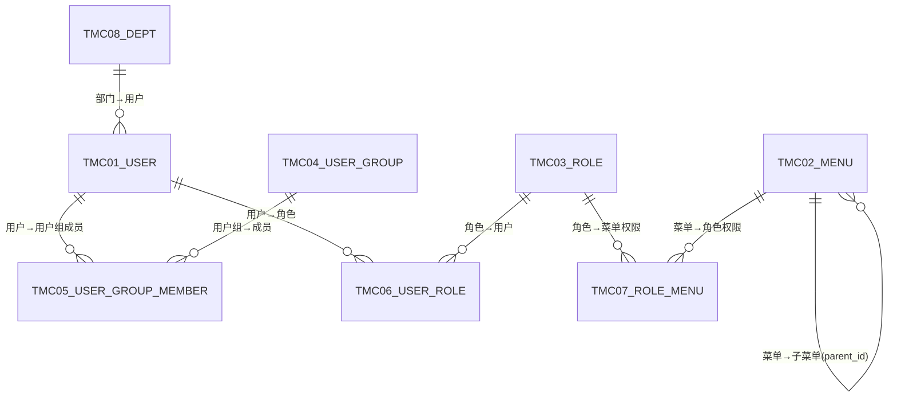

| 模型 | 表名 | 主键 | 说明 |
|------|------|------|------|
| User | TMC01_USER | user_cd | 系统用户 |
| Menu | TMC02_MENU | menu_id | 菜单（支持树形） |
| Role | TMC03_ROLE | role_cd | 角色 |
| UserGroup | TMC04_USER_GROUP | group_cd | 用户组 |
| UserGroupMember | TMC05_USER_GROUP_MEMBER | id | 用户组成员（多对多） |
| UserRole | TMC06_USER_ROLE | id | 用户角色（多对多） |
| RoleMenu | TMC07_ROLE_MENU | id | 角色菜单权限（多对多） |
| Department | TMC08_DEPT | dept_cd | 部门 |
| SysParm | TMC09_SYSPARM | parm_cd | 系统参数 |
| CodeTable | TMC10_CODE_TABLE | code_type + code_value | 编码表 |
| AuditLog | TMC11_AUDIT_LOG | id | 审计日志 |

---

### 2.2 主数据域（13个模型）

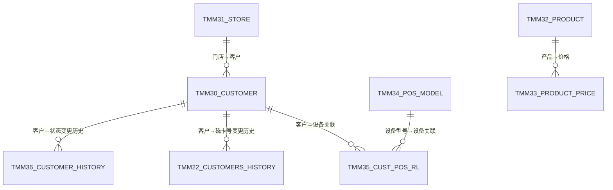

| 模型 | 表名 | 主键 | 说明 |
|------|------|------|------|
| Customer | TMM30_CUSTOMER | custcd | 客户主数据 |
| Store | TMM31_STORE | storecd | 门店 |
| Product | TMM32_PRODUCT | prdcd | 产品 |
| ProductPrice | TMM33_PRODUCT_PRICE | id | 产品价格 |
| PosModel | TMM34_POS_MODEL | model_cd | 设备型号 |
| CustPosRl | TMM35_CUST_POS_RL | eid | 客户-设备关联（资产台账） |
| CustomerHistory | TMM36_CUSTOMER_HISTORY | id | 客户状态变更历史 |
| CustomersHistory | TMM22_CUSTOMERS_HISTORY | id | 磁卡号变更历史（P0优化） |
| Area | TMM40_AREA | area_cd | 区域 |
| Engineer | TMM41_ENGINEER | engr_cd | 工程师 |
| Supplier | TMM42_SUPPLIER | suppliercd | 供应商 |
| Equipment | TMM43_EQUIPMENT | eid | 设备主数据 |
| EquipmentType | TMM44_EQUIPMENT_TYPE | type_cd | 设备类型 |

---

### 2.3 ITSM 核心域（34个模型）

#### 核心主子表关系

```mermaid
erDiagram
    TIT10_MAINTENANCEDAY ||--o{ TIT10_POS_DETAIL : "维护单→配件明细"
    TIT10_MAINTENANCEDAY ||--o{ TIT10_MAIN_TRACK : "维护单→状态轨迹"
    TIT10_MAINTENANCEDAY ||--o{ TIT23_D2D : "维护单→上门服务"
    TIT10_MAINTENANCEDAY ||--o{ TIT25_ACCESSORIES : "维护单→配件更新"

    TIT13_MAINTENANCE_OPEN ||--o{ TIT14_EQUIPMENT_OPEN : "开通单→设备附表"

    TIT15_MAINTENANCE_RENOVATE ||--o{ TIT15_EQUIPMENT_RENOVATE : "翻新单→设备附表"

    TIT17_MAINTENANCE ||--o{ TIT17_CUST_POS_DAILY : "保养单→设备明细"
    TIT17_MAINTENANCE ||--o{ TIT23_D2D : "保养单→上门服务"
    TIT17_MAINTENANCE ||--o{ TIT24_RV : "保养单→回访记录"
    TIT17_MAINTENANCE ||--o{ TIT27_CLOSE_BILLS : "保养单→关单记录"

    TIT16_DEVICE_CHANGE ||--o{ TMM22_CUSTOMERS_HISTORY : "变更单→磁卡号历史"

    TIT20_RECYCLE_TASK ||--o{ TIT20_RECYCLE_TASK_DTL : "回收任务→明细"
```

#### 主表（6个）— 共享统一状态机

| 模型 | 表名 | 主键 | 关联键 |
|------|------|------|--------|
| MaintenanceDaily | TIT10_MAINTENANCEDAY | maintenance_id | → PosDetail, Track, D2D, Accessories |
| MaintenanceOpen | TIT13_MAINTENANCE_OPEN | new_opening_id | → EquipmentOpen |
| MaintenanceRenovate | TIT15_MAINTENANCE_RENOVATE | renovate_id | → EquipmentRenovate |
| DeviceChange | TIT16_DEVICE_CHANGE | change_id | → CustomersHistory(CK类型) |
| Maintenance | TIT17_MAINTENANCE | maintenance_id | → CustPosDaily, D2D, RV, CloseBill |
| RecycleTask | TIT20_RECYCLE_TASK | recycle_id | → RecycleTaskDtl |

#### 子表/明细表（8个）

| 模型 | 表名 | 关联主表 | 关联字段 |
|------|------|---------|---------|
| PosDetail | TIT10_POS_DETAIL | MaintenanceDaily | maintenance_id |
| MainTrack | TIT10_MAIN_TRACK | MaintenanceDaily | maintenance_id |
| EquipmentOpen | TIT14_EQUIPMENT_OPEN | MaintenanceOpen | new_opening_id |
| EquipmentRenovate | TIT15_EQUIPMENT_RENOVATE | MaintenanceRenovate | renovate_id |
| CustPosDaily | TIT17_CUST_POS_DAILY | Maintenance | maintenance_id |
| RecycleTaskDtl | TIT20_RECYCLE_TASK_DTL | RecycleTask | recycle_id |
| StoreClose | TIT18_STORE_CLOSE | — | close_id（独立单据） |
| FreeReplace | TIT19_FREE_REPLACE | — | replace_id（独立单据） |

#### 公用附表（5个）— 跨业务单据复用

| 模型 | 表名 | 关联方式 | 说明 |
|------|------|---------|------|
| D2D | TIT23_MAINTENANCE_D2D | maintenance_id + maintenance_type | 上门服务记录 |
| RV | TIT24_MAINTENANCE_RV | maintenance_id + maintenance_type | 客户回访记录 |
| AccessoriesUpdate | TIT25_ACCESSORIES_UPDATE | maintenance_id | 配件更新记录 |
| Dispatch | TIT26_DISPATCH | maintenance_id + maintenance_type | 工单分派记录 |
| CloseBill | TIT27_CLOSE_BILLS | maintenance_id + maintenance_type | 关单记录 |

#### 字典表（6个）

| 模型 | 表名 | 说明 |
|------|------|------|
| FaultType | TIT01_FAULT_TYPE | 故障类型字典 |
| ServiceType | TIT02_SERVICE_TYPE | 服务类型字典 |
| Priority | TIT03_PRIORITY | 优先级字典 |
| StatusDef | TIT04_STATUS_DEF | 状态定义字典 |
| ChangeType | TIT05_CHANGE_TYPE | 变更类型字典 |
| PosType | TIT06_POS_TYPE | 设备类型字典 |

---

### 2.4 仓储域（15个模型）

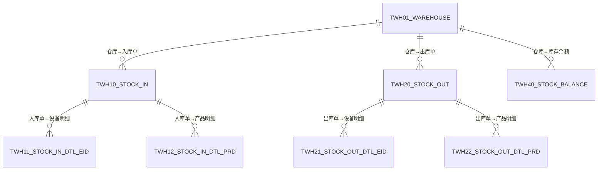

| 模型 | 表名 | 主键 | 说明 |
|------|------|------|------|
| Warehouse | TWH01 | whcd | 仓库主数据 |
| WarehouseZone | TWH02 | zone_id | 库区 |
| WarehouseLocation | TWH03 | loc_id | 库位 |
| StockIn | TWH10 | inbillid | 入库单主表 |
| StockInDtlEid | TWH11 | id | 入库设备明细 |
| StockInDtlPrd | TWH12 | id | 入库产品明细 |
| StockOut | TWH20 | outbillid | 出库单主表 |
| StockOutDtlEid | TWH21 | id | 出库设备明细 |
| StockOutDtlPrd | TWH22 | id | 出库产品明细 |
| StockBalance | TWH40 | id | 库存余额 |
| StockFlow | TWH41 | id | 库存流水 |
| StockCheck | TWH50 | check_id | 盘点单 |
| StockCheckDtl | TWH51 | id | 盘点明细 |
| Transfer | TWH60 | trans_id | 调拨单 |
| TransferDtl | TWH61 | id | 调拨明细 |

---

### 2.5 采购域（10个模型）

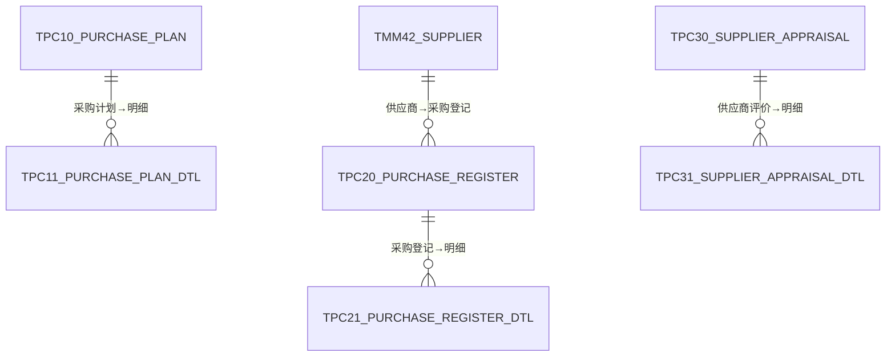

| 模型 | 表名 | 主键 | 说明 |
|------|------|------|------|
| PurchasePlan | TPC10 | pcplanid | 采购计划 |
| PurchasePlanDtl | TPC11 | id | 采购计划明细 |
| PurchaseRegister | TPC20 | rgstbillid | 采购登记 |
| PurchaseRegisterDtl | TPC21 | id | 采购登记明细 |
| PurchaseBill | TPC30 | pcbillid | 采购单据 |
| PurchaseReturn | TPC40 | rtbillid | 采购退货 |
| PurchaseReturnDtl | TPC41 | id | 退货明细 |
| SupplierAppraisal | TPC50 | appid | 供应商评价 |
| SupplierAppraisalDtl | TPC51 | id | 评价明细 |
| PurchaseContract | TPC60 | pccontractid | 采购合同 |

---

### 2.6 销售域（4个模型）

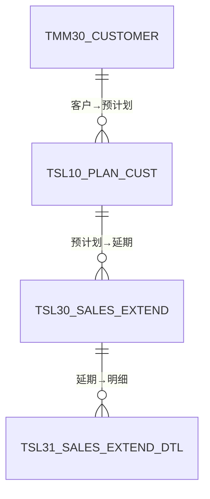

| 模型 | 表名 | 主键 | 说明 |
|------|------|------|------|
| PlanCust | TSL10 | planno | 预计划 |
| SalesBill | TSL20 | slbillid | 销售单据 |
| SalesExtend | TSL30 | opbillid | 延期 |
| SalesExtendDtl | TSL31 | id | 延期明细 |

---

### 2.7 辅助管理域（15个模型）

#### 考勤（2个）

| 模型 | 表名 | 说明 |
|------|------|------|
| Attendance | TKQ01 | 考勤记录 |
| AttendanceCount | TKQ02 | 考勤月度汇总 |

#### 库存预警 + 价格（4个）

| 模型 | 表名 | 说明 |
|------|------|------|
| InventoryLimit | TIV01 | 库存预警规则 |
| InventoryAlert | TIV02 | 库存预警记录 |
| Price | TIP01 | 价格规则 |
| AdjustPrice | TIP03 | 调价记录 |

#### 押金（5个）

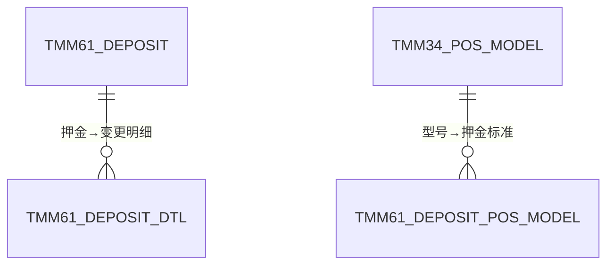

| 模型 | 表名 | 说明 |
|------|------|------|
| Deposit | TMM61 | 押金主表 |
| DepositDetail | TMM61_DTL | 押金变更明细 |
| DepositPosModel | TMM61_POS_MODEL | 型号押金标准 |
| DepositRefund | TMM61_REFUND | 退押金记录 |
| DepositFrozen | TMM61_FROZEN | 押金冻结记录 |

#### 合同 + 发票（2个）

| 模型 | 表名 | 说明 |
|------|------|------|
| Contract | THT01 | 合同 |
| Invoice | TAC01 | 发票 |

#### 通知系统（2个）

| 模型 | 表名 | 说明 |
|------|------|------|
| NotificationTemplate | TNTF01 | 通知模板 |
| Notification | TNTF02 | 通知记录 |

---

### 2.8 SLA 服务级别域（2个模型）

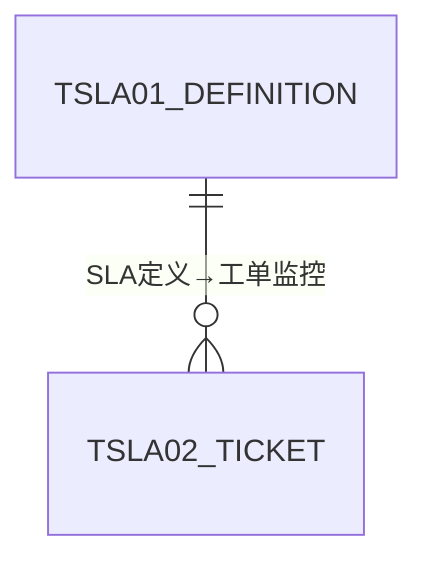

| 模型 | 表名 | 说明 |
|------|------|------|
| SlaDefinition | TSLA01 | SLA定义（响应/解决时限） |
| SlaTicket | TSLA02 | SLA工单监控记录 |

---

### 2.9 结算域（4个模型，Tier-2 G4）

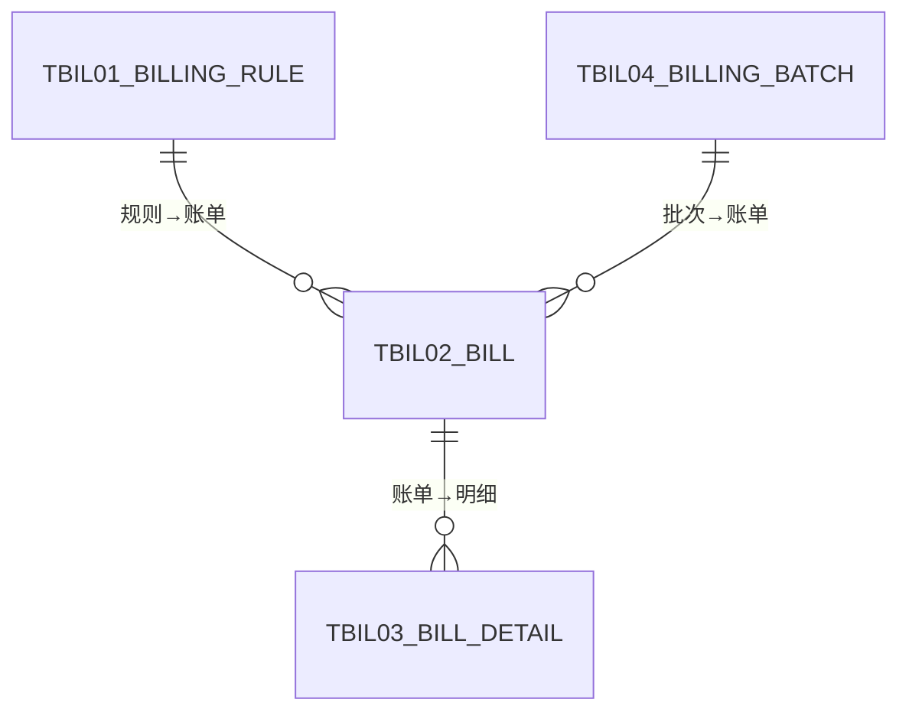

| 模型 | 表名 | 说明 |
|------|------|------|
| BillingRule | TBIL01 | 结算规则 |
| Bill | TBIL02 | 账单主表 |
| BillDetail | TBIL03 | 账单明细 |
| BillingBatch | TBIL04 | 结算批次 |

---

### 2.10 财务域（5个模型，Tier-2 G5）

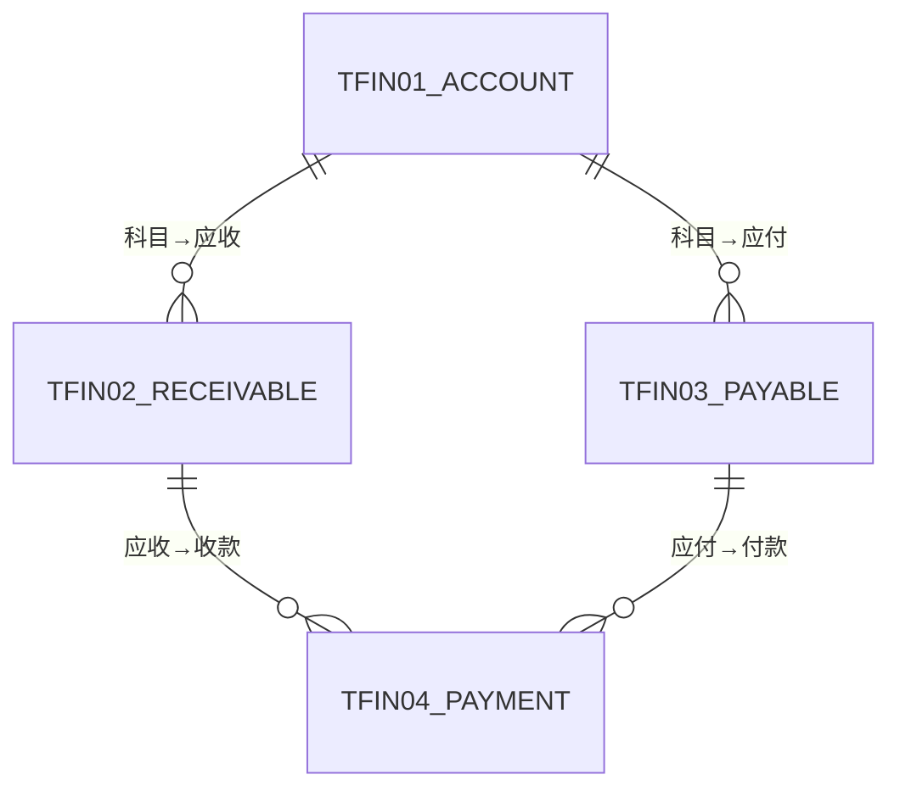

| 模型 | 表名 | 说明 |
|------|------|------|
| Account | TFIN01 | 会计科目 |
| Receivable | TFIN02 | 应收 |
| Payable | TFIN03 | 应付 |
| Payment | TFIN04 | 收付款 |
| Depreciation | TFIN05 | 设备折旧 |

---

### 2.11 客户门户域（3个模型，Tier-2 G9）

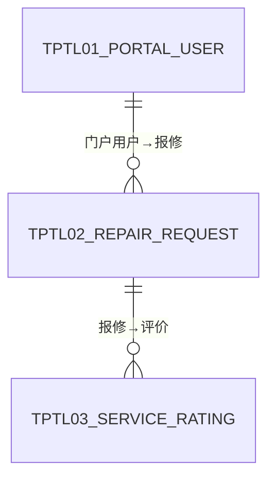

| 模型 | 表名 | 说明 |
|------|------|------|
| PortalUser | TPTL01 | 门户用户 |
| RepairRequest | TPTL02 | 自助报修 |
| ServiceRating | TPTL03 | 服务评价 |

---

### 2.12 MES 制造域（4个模型，Tier-3 G7）

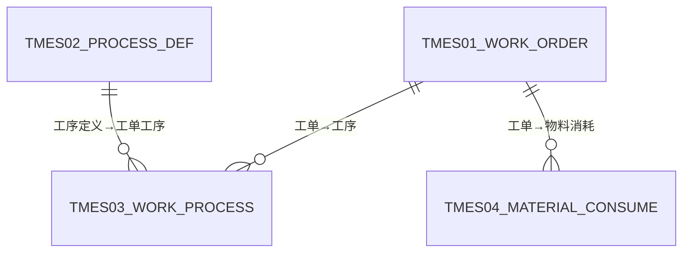

| 模型 | 表名 | 说明 |
|------|------|------|
| WorkOrder | TMES01 | 生产工单 |
| ProcessDef | TMES02 | 工序定义 |
| WorkProcess | TMES03 | 工单工序 |
| MaterialConsume | TMES04 | 物料消耗 |

---

### 2.13 IoT 监控域（4个模型，Tier-3 G8）

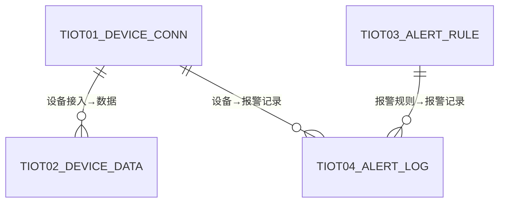

| 模型 | 表名 | 说明 |
|------|------|------|
| DeviceConn | TIOT01 | 设备接入 |
| DeviceData | TIOT02 | 设备数据 |
| AlertRule | TIOT03 | 报警规则 |
| AlertLog | TIOT04 | 报警记录 |

---

## 三、跨域关键关联

| 源域 | 目标域 | 关联路径 | 说明 |
|------|--------|---------|------|
| ITSM | 主数据 | maintenance.custcd → Customer.custcd | 工单关联客户 |
| ITSM | 主数据 | maintenance.store_id → Store.storecd | 工单关联门店 |
| ITSM | 主数据 | device_change → CustomersHistory | 设备变更记录磁卡号历史 |
| 仓储 | 主数据 | stock_in/out.itemcd → Product/Equipment | 出入库关联物品 |
| 采购 | 主数据 | register.suppliercd → Supplier.suppliercd | 采购关联供应商 |
| 销售 | 主数据 | plan_cust.custcd → Customer.custcd | 预计划关联客户 |
| 押金 | 主数据 | deposit.custcd → Customer.custcd | 押金关联客户 |
| 押金 | 主数据 | deposit_pos_model.model_cd → PosModel | 押金关联设备型号 |
| SLA | ITSM | sla_ticket.maintenance_id → 各主表 | SLA监控关联工单 |
| 结算 | 主数据 | bill.custcd → Customer.custcd | 账单关联客户 |
| 财务 | 主数据 | receivable.custcd → Customer.custcd | 应收关联客户 |
| 财务 | 主数据 | payable.supp_cd → Supplier.suppliercd | 应付关联供应商 |
| 门户 | ITSM | repair_request → MaintenanceDaily | 自助报修转工单 |
| IoT | 主数据 | device_conn.eid → Equipment.eid | IoT设备关联资产 |
| MES | 主数据 | material_consume.itemcd → Product | 物料消耗关联产品 |

---

## 四、模型数量汇总

| 业务域 | 模型数 | 阶段 |
|--------|--------|------|
| 系统管理 | 11 | 阶段1 |
| 主数据 | 13 | 阶段1 |
| ITSM 核心 | 34 | 阶段2 |
| 仓储 | 15 | 阶段3 |
| 采购 | 10 | 阶段3 |
| 销售 | 4 | 阶段3 |
| SLA | 2 | 阶段3 |
| 考勤 | 2 | 阶段4 |
| 库存价格 | 4 | 阶段4 |
| 押金 | 5 | 阶段4 |
| 合同发票 | 2 | 阶段4 |
| 通知 | 2 | 阶段4 |
| 结算 | 4 | 阶段5 |
| 财务 | 5 | 阶段5 |
| 门户 | 3 | 阶段5 |
| MES | 4 | 阶段5 |
| IoT | 4 | 阶段5 |
| **合计** | **124** | |
